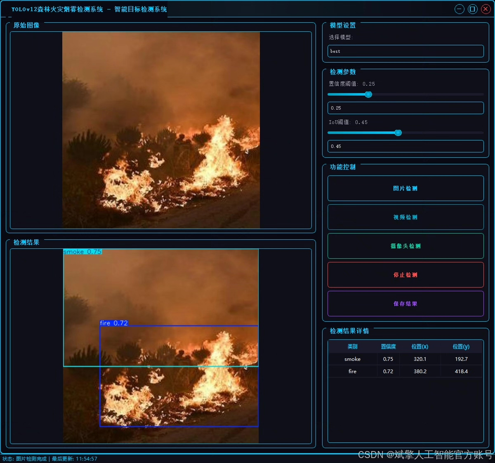
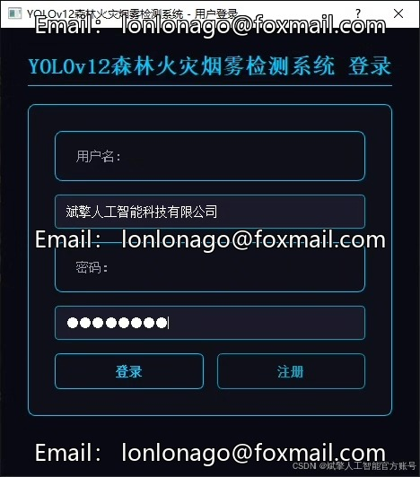
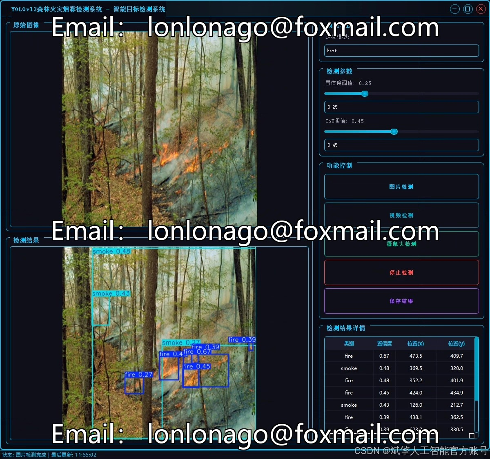
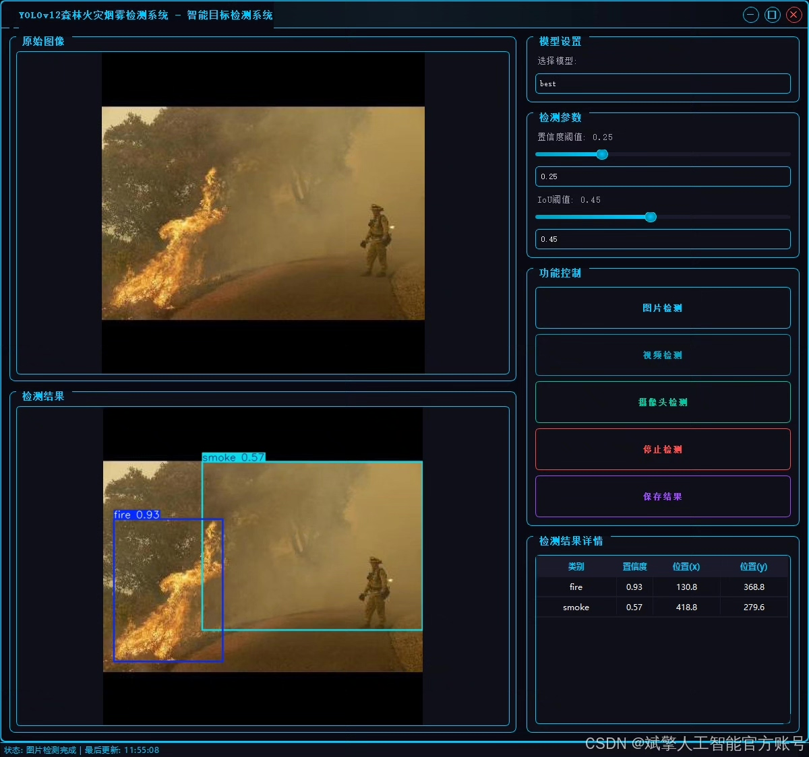
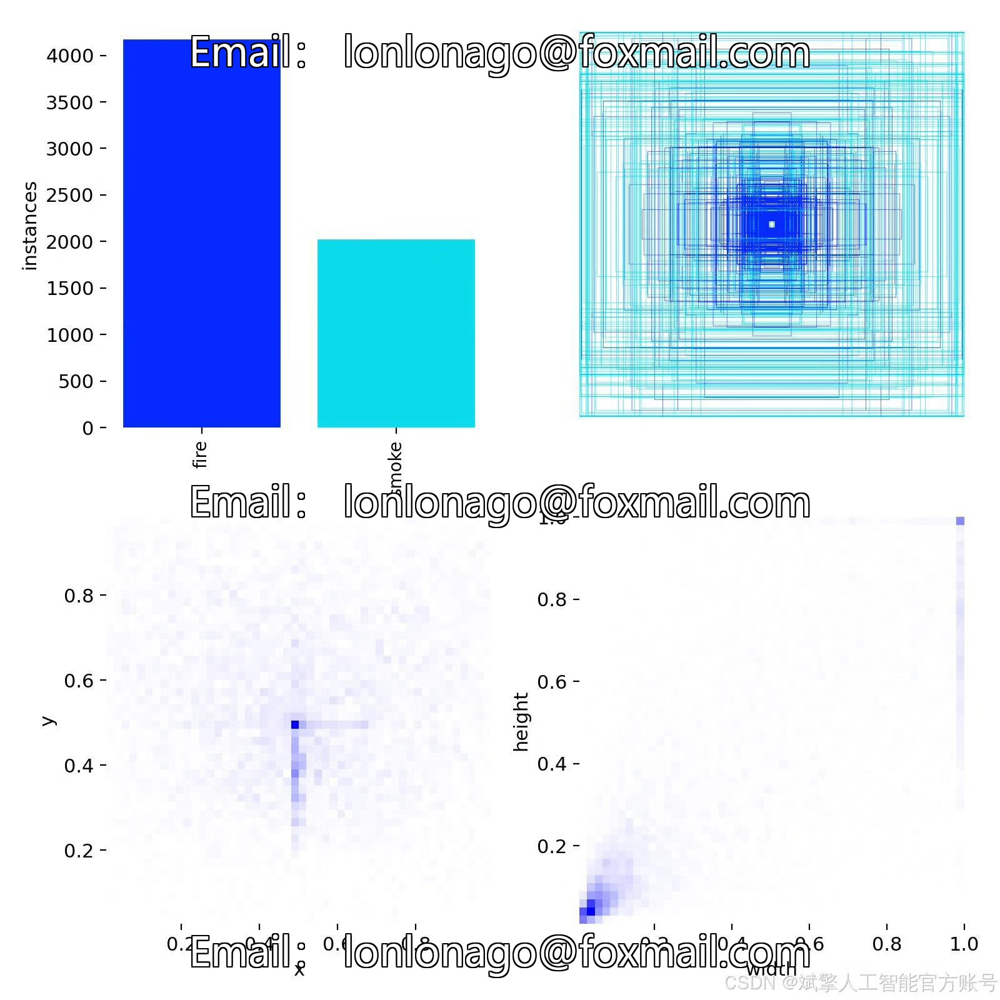
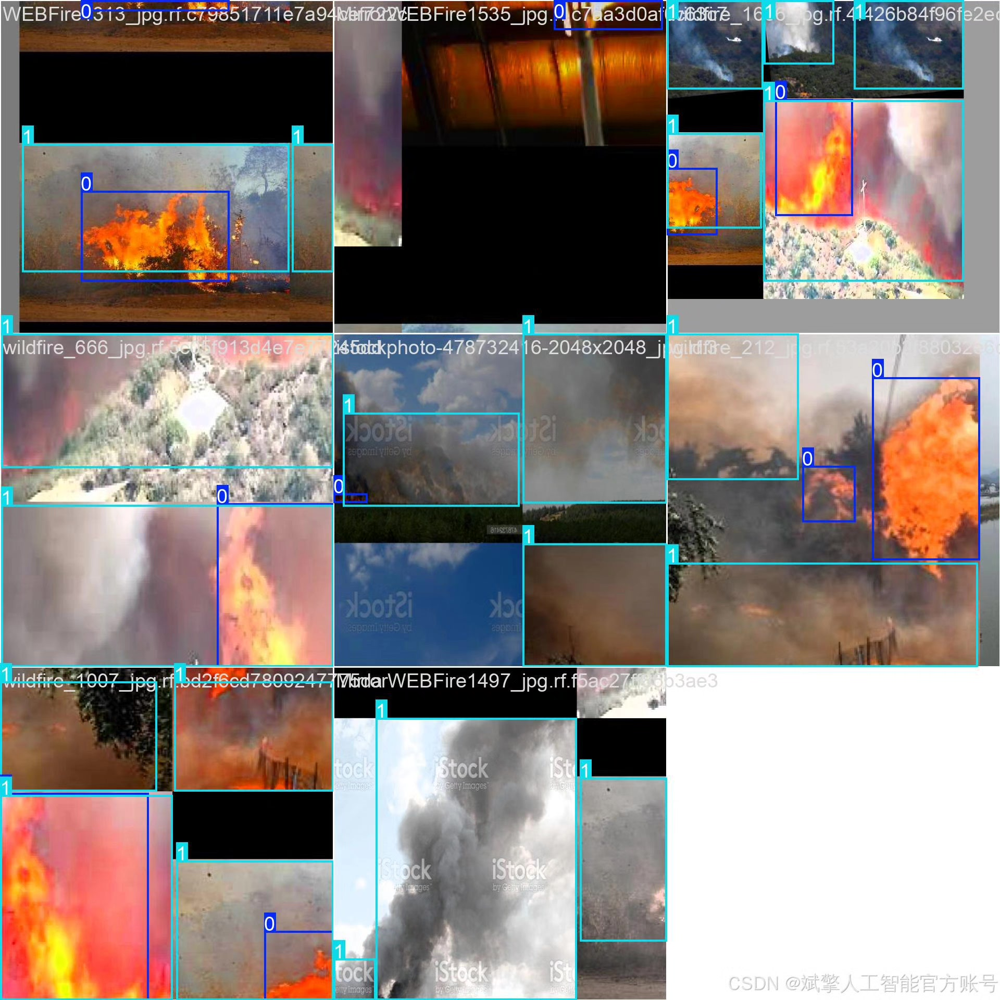
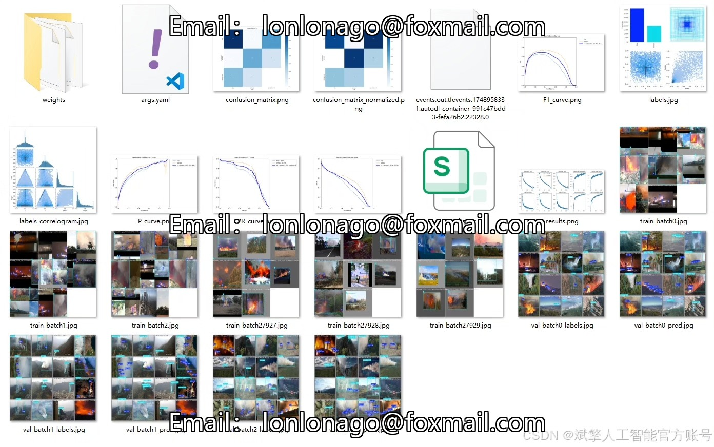
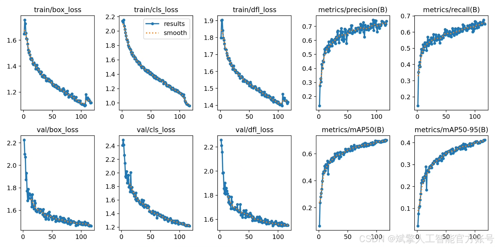
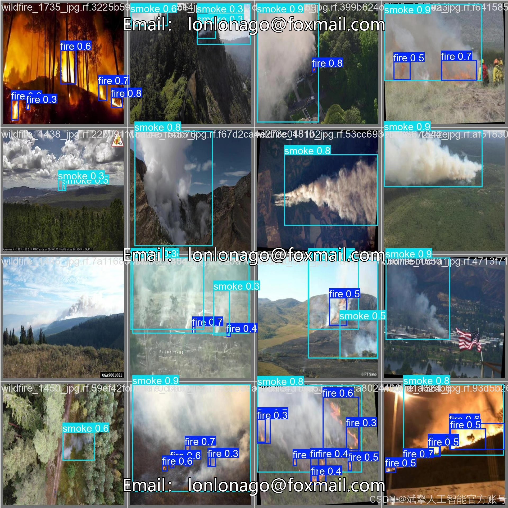

# YOLOv12 Forest Fire Smoke Detection System

## Body

The YOLOv12 Forest Fire Smoke Identification System, based on deep learning and the YOLOv12 target detection algorithm, has been developed to efficiently identify forest fire smoke.

Forest fires are one of the significant disasters that threaten ecological environments and human safety. The accurate identification of early-stage fire smoke is crucial for fire warning and prevention. This paper constructs an efficient forest fire smoke identification system using the deep learning target detection algorithm YOLOv12. The system employs the YOLOv12 model to detect fire (fire) and smoke (smoke) targets, with a training set containing 2083 labeled images. The validation set and test set consist of 260 and 261 images respectively, ensuring the generalization capability of the model. The system integrates a user-friendly UI interface, supporting login and registration functions, achieving a full process from data collection, model training to visualization detection. Experimental results show that the system can quickly and accurately identify fire smoke in complex forest scenarios, providing an intelligent solution for early warning of forest fires.

✅ User Login and Registration: Supports password verification and security validation.
✅ Three detection modes: Based on the YOLOv12 model, supports image, video, and real-time camera detection, accurately identifying targets.
✅ Dual-screen comparison: Displays the original scene and detection results on the same screen.
✅ Data Visualization: Real-time table displays the category, confidence, and coordinates of detected targets.
✅ Intelligent parameter adjustment: Offers a confidence slide bar to dynamically optimize detection accuracy, adapting to different scene requirements.
✅ Sci-fi style interactive interface: Dark theme combined with dynamic light effects, reducing visual fatigue and enhancing operational experience.

## Images

## Payment

Here is a pay link on Stripe ( https://buy.stripe.com/3cs8yP7sY87d0vu9AB ). Please contact me lonlonago@foxmail.com after funding $89, and I will send you a complete data files , thank you!

